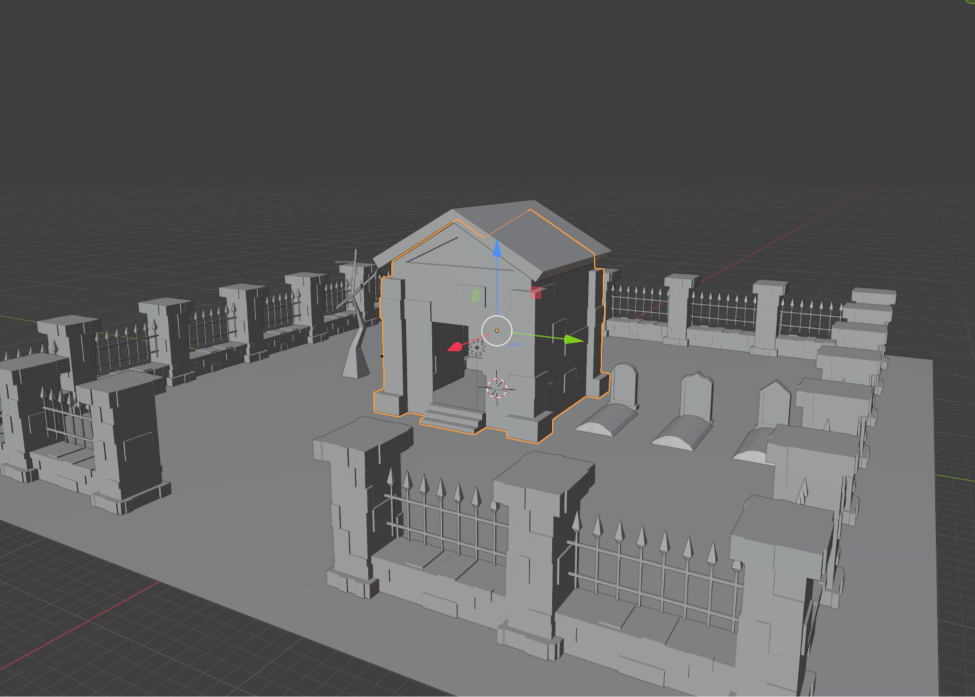

# Afterlife Metal

Author: Raeshana Sookhoo

Design: The player's progression builds the background music itself.

Screen Shot:

How To Play:

It's not death metal, but it isn't life metal either-- no, it's AFTERLIFE metal! 
Find and play the instruments of each ghost to return music to the world.

This game was built with [NEST](NEST.md).
