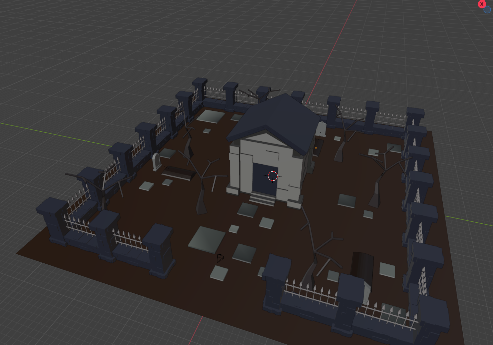

# Afterlife Metal

Author: Raeshana Sookhoo

Design: The player's progression adds layers to the background music.

Screen Shot:

How To Play:

WASD to move, ESC to toggle mouse grab.
Type in the numbers at the bottom left of the screen to return sound to the world.

It's not death metal, but it isn't life metal either-- no, it's AFTERLIFE metal! 
Find and play the instruments of each ghost to return music to the world.

This game was built with [NEST](NEST.md).
